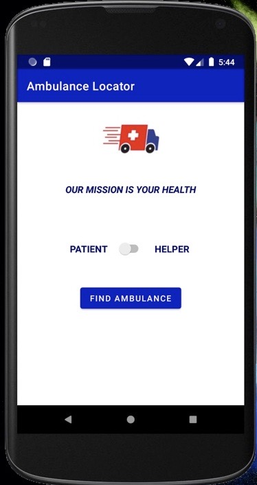
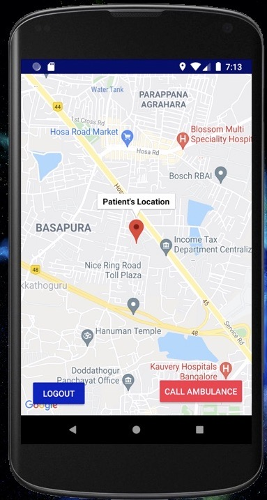
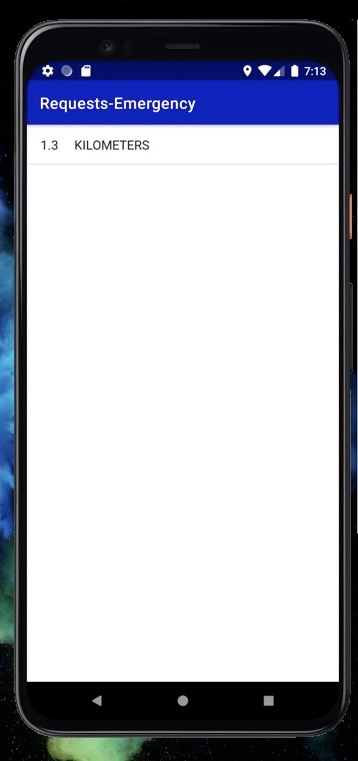
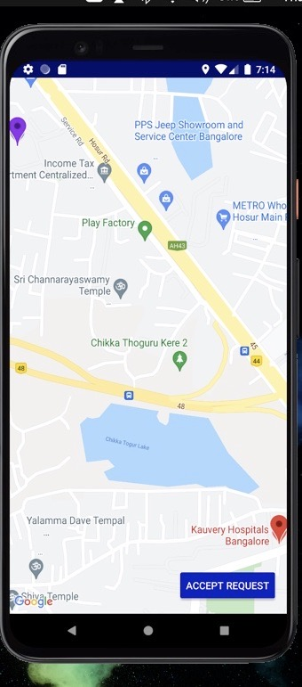
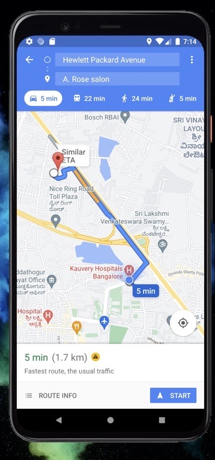
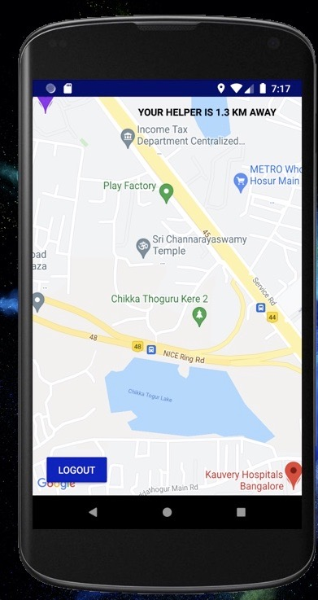
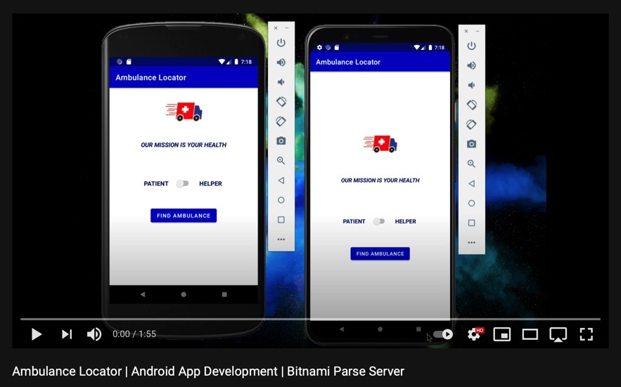

# AmbulanceLocator
### What does the app do?
- The app lets the user find nearby and as well as call the nearby ambulances. 
- The user doesnt need to login as he shall presumably be in an emergency situation , so an anonymous login is used.
- The app lets the user login as helper or patient .
- The helper can see the nearby requests and accept a request and he/she will be directed to google maps with the directions to the route.
- The patient can also see the realtime location of the help as well as see how far the helper is at.
- The locations's are updated in the server in realtime as well.
### What services and dependencies are used ?
- AWS EC2 Bitnami Parse Server
- Google Maps API v2
- Android Studio 4.1.2
- Programming Language used : Java
### Preview of the app
  
 
   

## Video of the app 

### Possible Developments in future
- Giving priorites to the patient's requests
- Mentioning the type of problem so that possible arrangements can be made
- Improvements in the UI 
### How to run the app ?
- Download the zip file or clone the repository 
- Activate the bitnami parse server get the respective clientID , appID and server-url
- Activate the googleMaps API - by getting the API Key
- Add in the details of googleMaps API in res > values > google_maps.xml
- Add in the details of Bitnami Parse Server in java > com.coviaid.package > StarterApplication
### References : 
- [Parse server reference](https://github.com/parse-community/Parse-SDK-Android)
- [Android studio reference](https://developer.android.com/)
- [Google Maps API reference](https://developers.google.com/maps)
- [Stack Overflow](https://stackoverflow.com)
